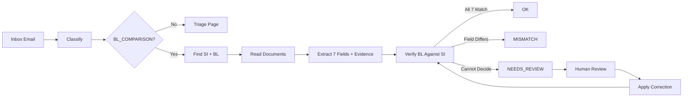

<div align="center">

# 🚢 ShipGuard AI

### Catch Bill of Lading defects before they leave the building.

**An evidence-first email triage and document-verification system for freight forwarders.**

ShipGuard reads incoming emails, identifies their purpose, finds the relevant shipping documents, compares the draft **Bill of Lading (BL)** against the customer's **Shipping Instruction (SI)**, and shows the evidence behind every decision.

**It does not guess. When the system cannot prove an answer, it sends the case to human review.**


[Quick Start](#quick-start) · [How It Works](#how-it-works) · [Results](#results) · [Team](#team)

</div>

---

## 🚢 What Is ShipGuard?

Freight-forwarding teams process large numbers of emails containing Shipping Instructions, draft Bills of Lading, invoices and operational updates.

A small BL error can cause an amendment, shipment delay or cargo-release problem.

ShipGuard automates the repetitive first-line checking:

**Inbox → Classify → Find documents → Extract → Compare → Prove → Review if uncertain**

The key design principle is simple:

> **The SI is the source of truth.**

For BL comparison cases, the draft BL is always checked against the customer's Shipping Instruction. The SI reference values remain read-only during human correction.

ShipGuard only reports a defect when the evidence supports it. If a document is missing, unreadable, the value cannot be extracted confidently, or the system otherwise cannot decide, the case becomes `NEEDS_REVIEW`.

---

# ⚡ 30-Second Overview

ShipGuard provides four core capabilities:

* 📬 **Email Triage** — every email is classified into exactly one of 5 classes.
* 🔎 **BL Verification** — BL values are compared against the SI using exactly 7 required fields.
* 🧾 **Evidence Grounding** — every extracted value can be traced back to its source document and raw text.
* 🧑‍⚖️ **Human Review & Re-verify** — uncertain cases can be corrected by a reviewer and passed through the same verification engine again.

The system is designed around **evidence rather than confidence alone**.

---

# 📬 The 5 Email Classes

Every email belongs to exactly one of these five classes:

| Class           | Purpose                                                      |
| --------------- | ------------------------------------------------------------ |
| `BL_COMPARISON` | SI and draft BL need to be checked against each other        |
| `SI_REQUEST`    | Shipping-instruction related request or document preparation |
| `INVOICE_QUERY` | Invoice, billing, freight, payment or local-charge questions |
| `GENERAL`       | Normal operational updates, reminders and confirmations      |
| `SPAM`          | Promotional, phishing or irrelevant messages                 |

### `BL_COMPARISON`

This is the only class that triggers the full document-verification workflow.

For these emails, ShipGuard:

1. Finds the SI and BL attachments.
2. Reads both documents.
3. Extracts the required 7 fields.
4. Normalises the values.
5. Compares the BL against the SI.
6. Produces `OK`, `MISMATCH` or `NEEDS_REVIEW`.
7. Shows the evidence supporting the result.

### Classification Strategy

Classification uses a **rules-first hybrid approach**:

1. A weighted rule classifier examines the subject, email body and attachment names.
2. High-confidence results are accepted immediately.
3. Uncertain cases can use the Gemini classification fallback.
4. If the LLM is unavailable, fails, or is not sufficiently confident, the case is routed to human review.

**The system never silently guesses a classification.**

Implementation:

```text
modules/classifier.py
modules/ai_classifier.py
modules/hybrid_classifier.py
```

---

# 🔐 SI Is the Source of Truth

For every `BL_COMPARISON` case:

```text
Customer Shipping Instruction (SI)
              │
              │ SOURCE OF TRUTH
              ▼
       ┌──────────────┐
       │ Verification │
       └──────────────┘
              ▲
              │
              │ compare
              │
       Draft Bill of Lading (BL)
```

The SI provides the reference value.

The BL is the document being checked.

Therefore:

* A BL value that differs from the SI can become a defect.
* A missing or unreadable BL value does not automatically become a mismatch.
* The reviewer cannot overwrite the SI reference value.
* Human corrections modify the BL side only.
* Every correction is sent back through the same `verify()` function.

This prevents a reviewer from accidentally bypassing the verification rules.

---

# 🔍 Exactly 7 Verification Fields

ShipGuard compares **exactly these seven fields — no more and no less**.

The single source of truth is:

```text
modules/schema.py
```

| # | Field               | Comparison                    |
| - | ------------------- | ----------------------------- |
| 1 | `shipper`           | Entity name                   |
| 2 | `consignee`         | Entity name                   |
| 3 | `notify_party`      | Notify-party name             |
| 4 | `port_of_loading`   | Port                          |
| 5 | `port_of_discharge` | Port                          |
| 6 | `container_count`   | Integer                       |
| 7 | `gross_weight_kg`   | Weight converted to kilograms |

### Normalisation Examples

ShipGuard normalises formatting differences without changing the underlying meaning.

Examples:

```text
PTE. LTD.        = PTE LTD
A & B TRADING    = A AND B TRADING
22,000 KG        = 22 MT
3                = 3.0
3 x 40'HC        = 3x40HC
```

Port identifiers and common document formatting differences are handled by the normalisation layer.

However, the comparison is intentionally conservative.

For example:

```text
KLANG            ≠ PORT KLANG
LIMITED          ≠ LTD
```

The system does not use broad fuzzy matching to manufacture a match.

---

# ✅ Verification Outcomes

Every BL comparison produces exactly one of three outcomes.

### `OK`

All 7 required fields are present, sufficiently confident and equal after normalisation.

### `MISMATCH`

Both sides contain usable values and at least one field is proven to be different.

The result includes:

```text
has_defect = true
defect_fields = [...]
discrepancies = [...]
```

### `NEEDS_REVIEW`

The system cannot safely decide.

Possible reasons include:

```text
wrong_doc_type
missing_attachment
unreadable
missing_value
```

The important distinction is:

> **Uncertainty is not treated as a mismatch.**

---

# 🧾 Evidence Grounding

ShipGuard does not only return a verdict.

For every extracted field, the application can show **where the value came from**.

Open a case and select:

**Evidence Grounding → View evidence for [field]**

The evidence panel shows:

* **Raw snippet** — the original label and value found in the document.
* **Source document** — SI or BL file.
* **Page / row information** where available.
* **Extraction method** — for example `text`, `pdf_text`, `ocr`, `docx`, `xlsx` or AI.
* **Confidence**.
* **Evidence status**.

Evidence statuses include:

```text
ACCEPTED
CANDIDATE_ONLY
NO_EVIDENCE
```

### Evidence-First Extraction

The extraction pipeline does not simply grab the first value it sees.

It:

1. Finds candidate values.
2. Ranks candidates using label similarity, position, plausibility and format.
3. Keeps rejected candidates as evidence.
4. Performs independent quality checks.
5. Produces the final accepted value with provenance.

This makes the result inspectable instead of a black-box prediction.

### OCR Safety

OCR values are treated conservatively.

OCR-only readings are capped at a lower confidence level and can be routed to review rather than being treated as certain.

---

# 🧑‍⚖️ Human Review / Re-verify

When ShipGuard returns `NEEDS_REVIEW`, the case enters the human-review workflow.

The reviewer can:

1. View the SI reference value.
2. View the extracted BL value and evidence.
3. Enter the corrected BL value.
4. Enter the reviewer name.
5. Add a correction note.
6. Click **Apply and Re-verify**.

The correction then goes through the **same verification engine** used for automatic checking.

```text
Human correction
       ↓
verify()
       ↓
┌───────────────┬────────────────┬──────────────────┐
│      OK       │   MISMATCH     │   NEEDS_REVIEW   │
└───────────────┴────────────────┴──────────────────┘
```

The SI remains the reference and cannot be changed by the reviewer.

### Audit Trail

The system records:

* reviewer
* field changed
* previous value
* new value
* correction note
* timestamp
* re-verification result

This creates a traceable human-in-the-loop workflow instead of an uncontrolled manual override.

---

<a id="how-it-works"></a>

# 🧭 How It Works



### Pipeline

**1. Classify**

Assign every email to one of the 5 classes.

**2. Route**

Find the relevant SI and BL attachments.

**3. Read**

Support:

* `.txt`
* `.pdf`
* scanned PDFs through OCR
* `.docx`
* `.xlsx`

**4. Extract**

Extract exactly the 7 verification fields together with evidence and confidence.

**5. Normalise**

Convert formatting and units into comparable representations.

**6. Verify**

Compare the BL against the SI.

**7. Review**

Escalate cases that cannot be safely decided.

**8. Re-verify**

Run human corrections through the same verification engine.

---

# 🏗️ Technical Architecture

ShipGuard is organised as a layered processing pipeline.

```text
┌──────────────────────────────┐
│          Streamlit UI        │
│ Dashboard / Review / Reports │
└──────────────┬───────────────┘
               │
               ▼
┌──────────────────────────────┐
│       Batch / Pipeline       │
│ classify → route → process   │
└──────────────┬───────────────┘
               │
       ┌───────┴────────┐
       ▼                ▼
┌─────────────┐   ┌───────────────┐
│ Classifier  │   │ Attachment    │
│ Rules + AI  │   │ Router        │
└─────────────┘   └───────┬───────┘
                          │
                          ▼
                 ┌─────────────────┐
                 │ Document Reader │
                 │ TXT/PDF/OCR/    │
                 │ DOCX/XLSX       │
                 └────────┬────────┘
                          │
                          ▼
                 ┌─────────────────┐
                 │ Field Extractor │
                 │ + Candidates    │
                 │ + Evidence      │
                 └────────┬────────┘
                          │
                          ▼
                 ┌─────────────────┐
                 │ Normalisation   │
                 │ + Quality Check │
                 └────────┬────────┘
                          │
                          ▼
                 ┌─────────────────┐
                 │ Verification    │
                 │ SI → BL         │
                 └────────┬────────┘
                          │
              ┌───────────┼───────────┐
              ▼           ▼           ▼
             OK       MISMATCH   NEEDS_REVIEW
                                      │
                                      ▼
                              Human Correction
                                      │
                                      ▼
                                  Re-verify
```

### Core Architectural Principles

**1. Single Source of Truth**

`modules/schema.py` defines the seven verification fields and their aliases.

**2. Separation of Responsibilities**

Classification, document reading, extraction, normalisation, evidence generation and verification are separated into different modules.

**3. Evidence Before Verdict**

Extraction produces provenance and evidence alongside the value.

**4. Deterministic Verification**

The final BL-versus-SI comparison is performed by the verification engine rather than by an LLM.

**5. Human-in-the-Loop**

Uncertain cases are explicitly represented as `NEEDS_REVIEW`.

**6. Reproducible Corrections**

Human corrections are passed through the same verification logic as automatic results.

---

# 🔧 Implementation Details

### Email Classification

The classifier uses weighted rules based on:

* subject
* email body
* attachment names
* class-specific keywords

Quoted email history is handled separately so that old messages do not unnecessarily influence the current classification.

The hybrid classifier uses rules first and calls Gemini only when the rule result is insufficiently confident.

### Attachment Routing

For `BL_COMPARISON` emails, the attachment router identifies likely SI and BL documents using:

* filename patterns
* document type
* content clues
* available document metadata

If the required document cannot be identified safely, the case is routed to review.

### Document Reading

The document reader provides a common text representation for multiple formats:

* TXT
* PDF
* Scanned PDF → OCR
* DOCX
* XLSX

Each reader preserves source information where possible so that extracted values can later be connected to their original location.

### Candidate Extraction

Rather than taking the first matching number or label, the field extractor generates candidates.

Candidates are evaluated using factors such as:

* label similarity
* location in the document
* value format
* plausibility
* units
* OCR risk

The candidate engine ranks the available evidence before a value is accepted.

### Independent Quality Validation

The quality layer checks extracted values independently.

Examples include:

* gross-weight plausibility
* gross/net/tare relationships
* container-to-weight sanity
* valid container counts
* valid units
* suspicious OCR values

This reduces the risk of an extractor simply accepting its own incorrect output.

### Verification Engine

The verification engine receives structured SI and BL values.

It applies canonical mapping and conservative normalisation before comparing the values.

The output is one of:

```text
OK
MISMATCH
NEEDS_REVIEW
```

The verification result also contains structured information such as:

```text
status
has_defect
defect_fields
discrepancies
review_reason
```

### Human Correction

Human corrections are applied only to the BL-side values.

The corrected values are passed back into:

```text
verify()
```

This means the human reviewer does not directly decide whether a case is `OK`.

---

# 🤖 AI Integration

AI is deliberately used as a **fallback rather than the final authority**.

### Gemini Classification

Gemini is used for uncertain email classification.

```text
Rules
  ↓
High confidence → accept

Medium / Low confidence
  ↓
Gemini fallback
  ↓
Confident → classification
Uncertain / error → human review
```

The classification layer expects a structured response rather than free-form text.

If Gemini is unavailable or returns an unusable response, ShipGuard does not invent a class.

### Optional AI Document Extraction

An optional AI extraction layer can assist with:

* unfamiliar document labels
* unusual layouts
* difficult scanned documents

AI-extracted values still have to pass the evidence and validation pipeline.

The AI layer is not allowed to silently invent values that are not supported by the document.

### AI Safety Principles

ShipGuard follows several restrictions:

* AI is not the source of truth.
* The SI remains the reference document.
* AI cannot override the verification engine.
* Unsupported values are not accepted as facts.
* Low-confidence or ambiguous results can be escalated.
* Human corrections are re-verified deterministically.

This makes AI an **assisting component rather than the decision-maker**.

---

<a id="results"></a>

# 📊 Results

The bundled reference run contains **520 emails**.

| Result            |   Count |
| ----------------- | ------: |
| `OK`              | **298** |
| `MISMATCH`        |  **40** |
| `NEEDS_REVIEW`    | **182** |
| Pipeline failures |   **0** |
| **Total**         | **520** |

That corresponds to approximately:

* **57% OK**
* **8% MISMATCH**
* **35% NEEDS_REVIEW**

The important reliability result is:

> **520 emails were processed with 0 pipeline failures.**

The system prefers a review queue over silently producing an unsupported answer.

The saved reference results are available in:

```text
demo_snapshot.json
```

---

# 🚀 Full Analysis

The **Home** page provides **Run Full Analysis**.

It processes the complete inbox through:

```text
Classify
   ↓
Route attachments
   ↓
Read documents
   ↓
Extract fields
   ↓
Build evidence
   ↓
Verify
   ↓
Aggregate results
```

### Live Progress

Processing is performed in chunks with live counters for:

```text
OK
MISMATCH
NEEDS_REVIEW
FAILED
```

### Pause / Continue

The analysis can be cancelled and continued from the saved checkpoint.

### Fault Tolerance

If one email encounters a processing problem, it does not stop the entire batch.

The problem is recorded and the remaining emails continue processing.

### Output

The full run updates:

* Dashboard
* Analytics
* Document Checks
* Recent Activity
* Human Review queue
* Discrepancy report

The submission builder also converts internal results into the organiser's required record format.

---

# 🎬 Demo Guide

For the clearest demonstration:

```text
Home
  ↓
Run Full Analysis
  ↓
Document Checks
  ↓
Open a MISMATCH
  ↓
Evidence Grounding
  ↓
Open a NEEDS_REVIEW case
  ↓
Human Correction
  ↓
Apply and Re-verify
  ↓
Audit Trail
```

The demonstration should highlight three main ideas:

1. **The SI is the source of truth.**
2. **Every important result has evidence.**
3. **Uncertainty is escalated instead of guessed.**

### 🎥 Demo Video

**[PASTE DEMO VIDEO URL HERE]**

---

<a id="quick-start"></a>

# 🛠️ Setup Instructions

### Requirements

* Python **3.11+**
* Tesseract OCR is optional for scanned PDFs.

The project was developed and tested with Python 3.13.

### Installation

Clone the repository:

```bash
git clone https://github.com/kelvinyap927/shipguard-ai.git
cd shipguard-ai
```

Create a virtual environment:

```bash
python -m venv .venv
```

Activate it:

**Windows**

```bash
.venv\Scripts\activate
```

**macOS / Linux**

```bash
source .venv/bin/activate
```

Install dependencies:

```bash
pip install -r requirements.txt
```

Start the application:

```bash
streamlit run app.py
```

Open the Streamlit URL, normally:

```text
http://localhost:8501
```

The repository includes the bundled inbox and document attachments, so no additional dataset download is required.

---

# ⚙️ Optional Configuration

ShipGuard can run without external AI APIs.

### Gemini Classification Fallback

Set:

```text
GEMINI_API_KEY=<your-key>
```

in `.env` to enable the LLM fallback for uncertain email classification.

Without the key:

```text
uncertain classification → NEEDS_REVIEW
```

### Optional AI Document Extraction

The optional AI extraction layer can be enabled with:

```text
SDOC_USE_AI=1
ANTHROPIC_API_KEY=<your-key>
```

Without it, the standard rule/OCR extraction pipeline remains available.

### Tesseract OCR

Install Tesseract if scanned PDFs need OCR.

For Ubuntu/Debian:

```bash
sudo apt install tesseract-ocr
```

For macOS:

```bash
brew install tesseract
```

For Windows, install Tesseract and ensure its executable is available to the system `PATH`.

Without Tesseract, unsupported scans can be routed to:

```text
NEEDS_REVIEW → unreadable
```

---

# 🧪 Command-Line Tools

Run extraction for the complete inbox:

```bash
python run_extraction.py
```

Inspect one email:

```bash
python show_extraction.py email_004
```

Extract one document:

```bash
python extract_file.py attachments/email_004_SI.txt
```

Generate a quality report:

```bash
python quality_report.py
```

---

# 🧪 Tests

The repository contains tests covering classification, extraction, routing, pipeline behaviour, stress cases and verification.

Examples:

```bash
python test_extraction.py
python test_stress.py
python test_hybrid_classifier.py
python test_hybrid_pipeline.py
python test_error_handling.py
python C.test_member_c.py
```

The stress tests include multiple label and formatting variations to check that normalisation does not turn genuine differences into false matches.

---

# 🧩 Challenges Faced

Several technical challenges shaped the final design.

### 1. Documents use inconsistent labels

The same field can appear under different labels.

For example:

```text
Port of Loading
POL
Load Port
Loading Port
```

The schema and label-alias system were therefore designed to map different labels to the same canonical field.

### 2. Formatting differences can look like real defects

Shipping documents can represent the same value in different ways:

```text
22,000 KG
22 MT
22 tonnes
```

Normalisation was required before comparison while still avoiding overly aggressive fuzzy matching.

### 3. OCR can introduce incorrect values

Scanned documents can produce characters and numbers that look valid but are incorrect.

The system therefore treats OCR-derived values more conservatively and can escalate them to human review.

### 4. Missing information is different from a mismatch

A blank BL field does not prove that the BL is wrong.

This led to the explicit distinction between `MISMATCH` and `NEEDS_REVIEW`.

### 5. AI services can fail

External APIs can be unavailable, rate-limited or return unusable responses.

The pipeline therefore has deterministic fallbacks and routes unresolved cases to human review instead of stopping the entire analysis.

### 6. Human corrections must remain trustworthy

Allowing reviewers to directly change a verdict could bypass the verification logic.

Instead, corrections are passed through the same `verify()` function and recorded in an audit trail.

### 7. Processing a full inbox must be fault tolerant

A single problematic email should not terminate a 520-email analysis.

The batch processor therefore isolates failures, records them and continues processing the remaining inbox.

---

# 🔭 Future Roadmap

Potential future improvements include:

### Live Mailbox Integration

Connect ShipGuard directly to an operational email inbox instead of a bundled dataset.

### Automatic Missing-Document Requests

Automatically prepare a response requesting a missing SI or BL.

### Additional Shipping Fields

Expand beyond the current seven fields to support fields such as:

* vessel
* voyage
* net weight
* commodity
* package count
* container type

### Reviewer Learning

Use validated reviewer corrections to improve aliases and extraction rules while keeping the final verification logic controlled.

### Production Deployment

Add:

* authentication
* persistent database storage
* role-based reviewer access
* enterprise mailbox integration
* monitoring and logging

### Broader Document Support

Improve support for more complex layouts, image-heavy documents and additional document formats.

The current architecture is designed so these improvements can be added without replacing the core verification workflow.

---

# 🗂️ Project Structure

```text
shipguard-ai/
│
├── app.py
│   └── Main Streamlit application and user workflow
│
├── member_c_verifier.py
│   └── Verification engine and human correction/re-verification
│
├── discrepancy_intelligence.py
│   └── Discrepancy analytics
│
├── export_report.py
│   └── CSV discrepancy report
│
├── demo_snapshot.json
│   └── Saved 520-email demonstration results
│
├── demo_snapshot.py
│   └── Demo snapshot generation
│
├── modules/
│   ├── classifier.py
│   │   └── Rule-based 5-class classifier
│   │
│   ├── ai_classifier.py
│   │   └── Gemini classification fallback
│   │
│   ├── hybrid_classifier.py
│   │   └── Rules first, LLM only when required
│   │
│   ├── attachment_router.py
│   │   └── Finds SI and BL attachments
│   │
│   ├── format_router.py
│   │   └── Detects document formats
│   │
│   ├── document_reader.py
│   │   └── TXT / PDF / OCR / DOCX / XLSX reading
│   │
│   ├── schema.py
│   │   └── Single source of truth for the 7 fields
│   │
│   ├── normalizer.py
│   │   └── Field and unit normalisation
│   │
│   ├── field_extractor.py
│   │   └── Extracts the 7 fields with evidence
│   │
│   ├── candidate_engine.py
│   │   └── Candidate ranking
│   │
│   ├── consensus_engine.py
│   │   └── Combines extraction evidence
│   │
│   ├── advanced_quality.py
│   │   └── Independent validation and quality checks
│   │
│   ├── ai_extractor.py
│   │   └── Optional AI extraction layer
│   │
│   ├── extraction_job.py
│   │   └── Extraction workflow
│   │
│   ├── evidence_builder.py
│   │   └── Evidence used by the UI
│   │
│   ├── pipeline.py
│   │   └── End-to-end email processing
│   │
│   ├── batch_processor.py
│   │   └── Full inbox processing
│   │
│   ├── result_aggregator.py
│   │   └── Result aggregation
│   │
│   └── submission_builder.py
│       └── Organiser submission format
│
├── inbox/
│   └── 520 bundled email records
│
├── attachments/
│   └── SI and BL documents
│
├── tests and test_*.py
│   └── Classification, extraction, routing and verification tests
│
├── README_MEMBER_B.md
│   └── Document reading and extraction deep dive
│
├── README_MEMBER_C.md
│   └── Verification engine deep dive
│
├── requirements.txt
│   └── Python dependencies
│
└── .streamlit/
    └── Streamlit configuration
```

For deeper technical details:

* `README_MEMBER_B.md` — document reading and field extraction.
* `README_MEMBER_C.md` — verification, normalisation and human correction.

---

# 🧱 Built With

| Technology        | Purpose                                     |
| ----------------- | ------------------------------------------- |
| **Python**        | End-to-end pipeline                         |
| **Streamlit**     | Dashboard and review interface              |
| **Rule engine**   | Classification and deterministic extraction |
| **Gemini**        | Classification fallback                     |
| **Tesseract OCR** | Scanned-document extraction                 |
| **python-docx**   | DOCX reading                                |
| **openpyxl**      | XLSX reading                                |
| **pdfplumber**    | PDF text extraction                         |
| **Pandas**        | Data handling and reporting                 |

The architecture is intentionally **rules-first**. AI is used only where it adds value and is not allowed to silently invent document values.

---

<a id="team"></a>

# 👥 Team Contribution

### YAP — Backend, Integration & Frontend

* Email classification and hybrid rule/LLM pipeline
* Attachment routing
* End-to-end pipeline
* Batch processing and progress tracking
* Result aggregation
* Submission builder
* Evidence builder
* Streamlit dashboard
* Human Review / Re-verify workflow
* Full Analysis workflow
* Discrepancy analytics
* CSV export
* Demo snapshot and deployment support

GitHub: [@kelvinyap927](https://github.com/kelvinyap927)

### Yenzi Chan — Document Reading & Field Extraction

* Multi-format document reader
* OCR support
* Seven-field schema and label aliases
* Field normalisation
* Field extraction
* Candidate ranking
* Consensus engine
* Independent validation
* Optional AI extraction layer
* Structured JSON export
* Extraction quality reporting
* Extraction and stress tests
* UI/navigation contributions
* README documentation

### Kai — Verification, Normalisation & Reliability

* Verification engine
* Canonical field mapping
* Conservative normalisation
* `OK` / `MISMATCH` / `NEEDS_REVIEW` policy
* Human correction and re-verification
* Audit trail
* Evidence persistence
* Submission-record generation
* Adversarial and regression tests
* Dataset validation

GitHub: [@Kai0822-hub](https://github.com/Kai0822-hub)

### Xin Rou — Presentation & Demo

* Simple HTML project page
* Demo video planning and production
* Demo video script writing and editing
* Demo narration and voice-over preparation
* Demo video editing and feature selection
* Demo flow and walkthrough planning
* Presentation slide preparation and editing
* Live demonstration preparation
* Judge-facing feature walkthrough
* Presentation rehearsal and coordination
* Overall visual and communication polish

---

# 🧹 Repository Cleanliness

The repository should contain the source code, configuration, tests and required dataset — **not local development environments or generated caches**.

Do not commit:

```text
.venv/
venv/
__pycache__/
*.pyc
.env
out/
```

These are covered by `.gitignore`.

**API keys must never be committed.**

Use `.env` locally for optional API configuration.

---

<div align="center">

## 🚢 ShipGuard AI

**Every verdict has evidence.
Every doubt has an owner.**

</div>